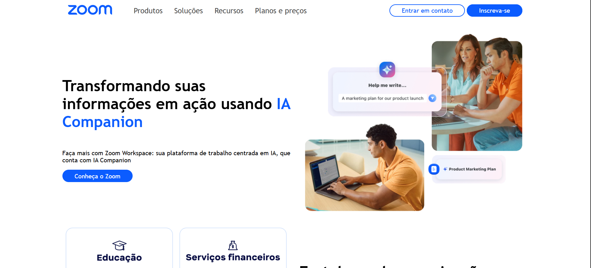

# Projeto de Prática HTML & CSS 🚀

## Descrição
Este projeto foi desenvolvido para **praticar HTML e CSS**, com foco em:
- Flexbox
- CSS Grid
- Responsividade usando @media queries

O objetivo foi consolidar conceitos de layout e criar uma página que se adapte a diferentes tamanhos de tela.

---

## Tecnologias Utilizadas
- HTML5
- CSS3 (Flexbox, Grid, Media Queries)

---

## Demonstração
Segue uma prévia do projeto:


*Visualização em desktop*


*Visualização em mobile*


---

## Aprendizados
Durante o desenvolvimento deste projeto, consegui praticar e consolidar:
- Estruturar layouts usando **Flexbox** e **Grid**.  
- Tornar elementos **responsivos** com media queries.  
- Organizar melhor meu CSS e aplicar boas práticas de **manutenção e leitura de código**.  
- Entender como elementos se comportam em diferentes tamanhos de tela.

---

## Como usar
1. Clone este repositório:
```bash
git clone https://github.com/victorhferreira02/Base-zoom.git
